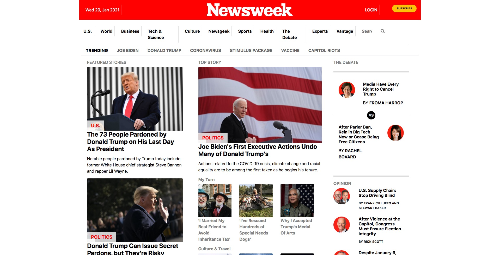

# Project 3 - NewsWeek Clone

> This is the Project 2 in the Microverse course

### View in browser
[Live](https://greg0109.github.io/NewsWeek/)

### Screenshot

## Built With

- HTML
- CSS

## Authors

👤 **Greg**

- GitHub: [@Greg0109](https://github.com/greg0109)
- Twitter: [@Greg_0109](https://twitter.com/greg_0109)

👤 **Marcus**

- GitHub: [@CatchMeIfYouCan](https://github.com/CacheMeGifYouCan)

## Getting Started

First ensure the assets folder is set in a location which is in the same folder as the other files. The Index and CSS should also be easily accessible. All the content in this project was linked to offline files in the assets folder.

To get a local copy up and running follow these simple example steps.

## Prequisites

Online website hoster ie. GoDaddy or similar

## Setup

Upload all files to the hosting service

## Install

Make sure each file is named correctly and accessible

## Usage

This website can be ran multiple times

## Run Tests

Use a code editor to make any changes or use your browser to access the website offline

## Deployment

Use a local broswer to deploy the project for testing

## Contributing

Contributions, issues, and feature requests are welcome!

Feel free to check the [issues page](https://github.com/Greg0109/NewsWeek/issues)

## 📝 License

This project is [MIT](LICENSE) licensed.
